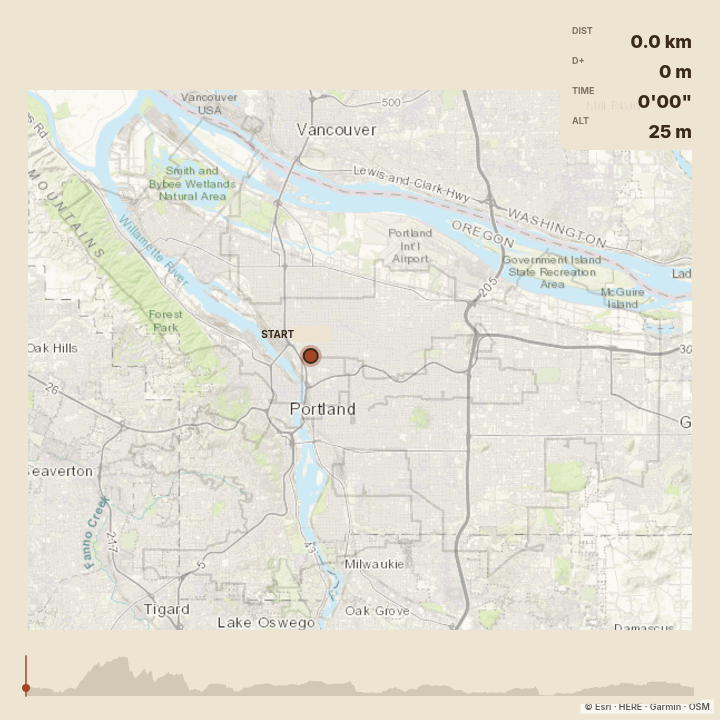

+++
title = "the plaid century"
date = "2026-08-28"
description = "biking to all 53 plaid pantries in portland"

[extra]
icon = "plaid-pantry.jpg"
+++

Two weeks ago, I participated in, rode, and finished the [Plaid Century](https://plaid100.org/). This was an incredible 100-mile ride to visit every Plaid Pantry convenience store in the city of Portland in a day. This was my most miles in a single day, with the previous record being the [Wildwood crows ride](/blog/biking-the-crows) I did the week prior. It was also, by far, the long continuous stretch I've been on a bike, probably by multiple times.

It was so much fun. There is no way I would have done a century before this. I never had any sort of distance biking on my radar as a fun activity, as I mostly just ride for commuting, for Portland social rides, and for light backpacking. Only something as silly as the Plaid Century could get me to get excited about getting up early, riding 100 miles in a day, spending 11.5 hours on my bike, bruising my butt, pulling my calf muscle, and nearly getting run over on highway 30.

{{ <gallery.embed manifest="/blog/plaid-century/gallery.toml" fragment="bag-setup" /> }}

I think this is the most fun bike event I've done so far, and it will take a lot to dethrone it. On my ride I ended up naturally finding a group to ride with, especially after I had pulled my calf muscle and had to really slow down my pace. I loved seeing so many people riding around, know that they were all heading toward the same goal as you. 

It was also neat way to see the city. Care was put into the route to make it nice to bike, but with more of a feeling that you are commuting through the city to meet up with friends or see a show than purely to put in miles on the saddle. It really was a ride that celebrated being in Portland. 

In the two weeks since, I've gotten into multiple conversations with other cyclists who see my Plaid Century sticker and have told my how much they enjoyed riding it, or how much they wish they had gotten to, or about their favorite silly randonneuring rides they've done. It seems to have really struck a chord with many Portland cyclists in the way it brings together bikes, fun, and Portland culture.

See the [BikePortland article](https://bikeportland.org/2026/08/17/a-rad-plaid-century-400089) for more photos and commentary.

## Photo Gallery

{{ <gallery manifest="/blog/plaid-century/gallery.toml" /> }}