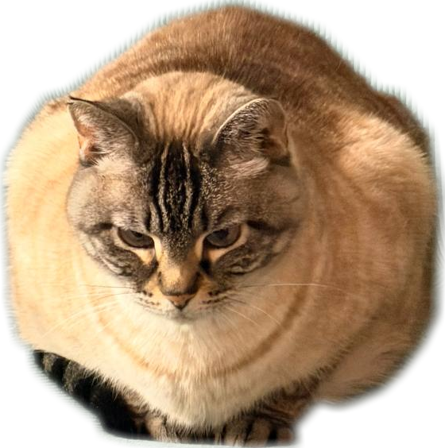

+++
title = "stuff ?"

[extra]
nav_title = "stuff ?"
+++

# My Stuff

## minecraft guys

`click to visit their page and learn more (maybe)`

<a href="/squid/">
{{ <rendering path="/squid/model.divs" projection={100} yaw={-135} pitch={16} y={100} z={500} /> }}
</a>
<a href="/fox/">
{{ <rendering path="/fox/model.divs" projection={100} yaw={-135} y={250} pitch={16} z={500} /> }}
</a>
<a href="/horse/">
{{ <rendering path="/horse/model.divs" projection={100} yaw={-135} y={250} pitch={16} z={500} /> }}
</a>
<a href="/skeleton-horse/">

{{ <rendering path="/skeleton-horse/model.divs" projection={100} yaw={-135} y={250} pitch={16} z={500} /> }}

</a>
<a href="/salmon/">
{{ <rendering path="/salmon/model.divs" projection={100} yaw={-135} y={250} pitch={16} z={500} /> }}
</a>
<a href="/borzoi/">
{{ <rendering path="/borzoi/model.divs" projection={100} yaw={-135} y={250} pitch={16} z={500} /> }}
</a>

## the octogon

